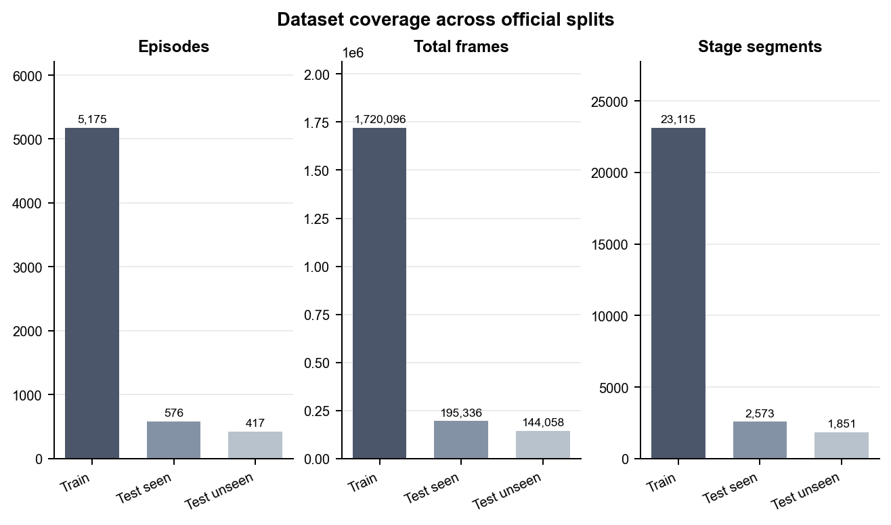
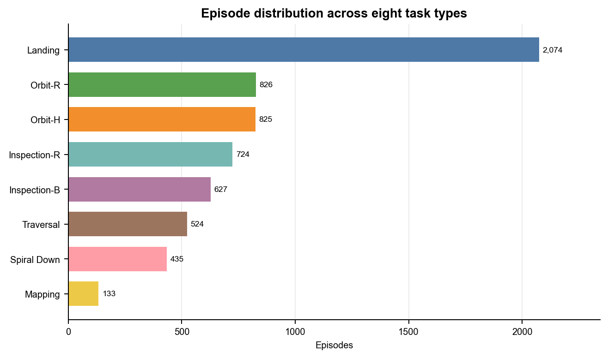
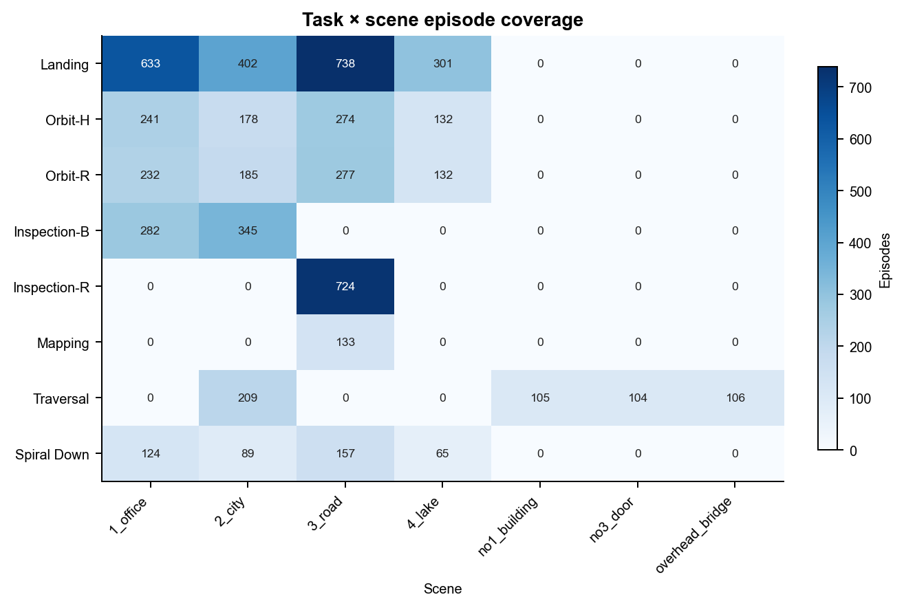
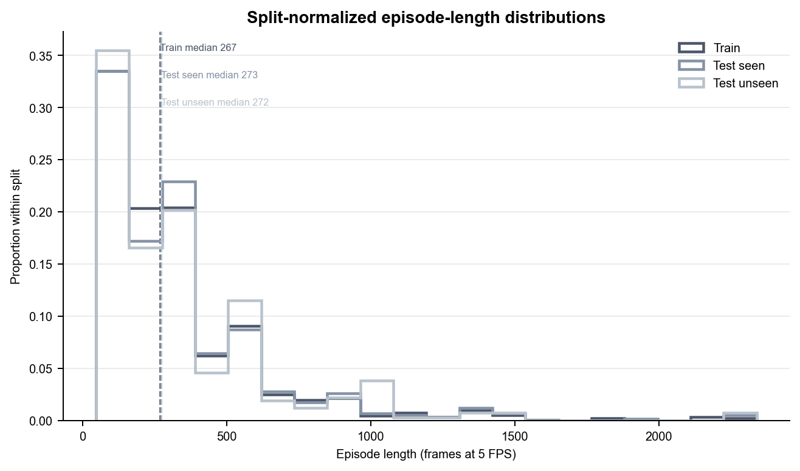
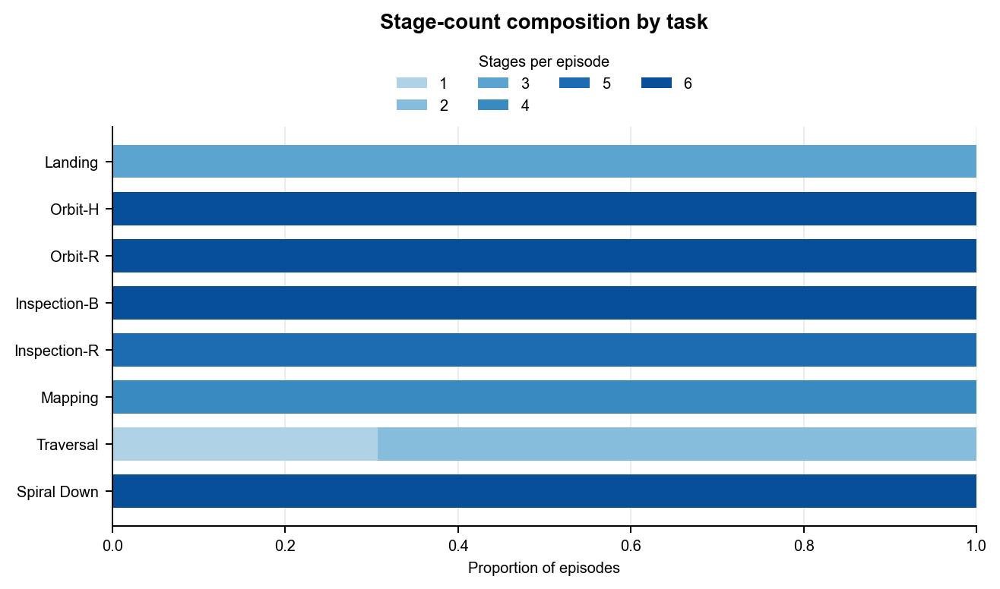
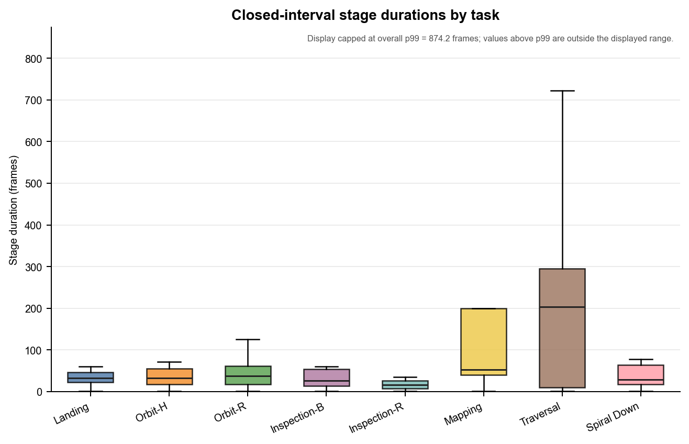
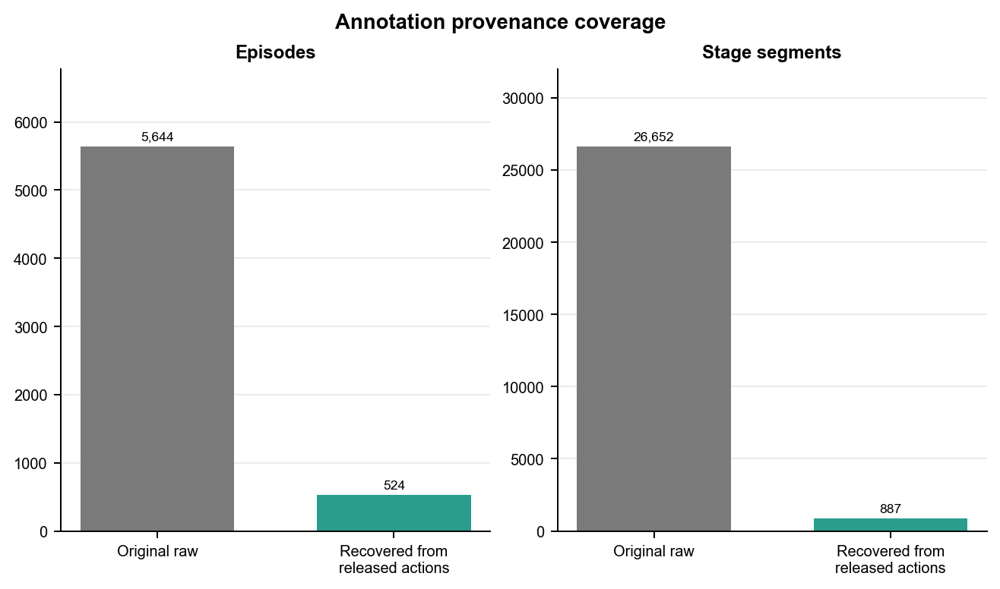
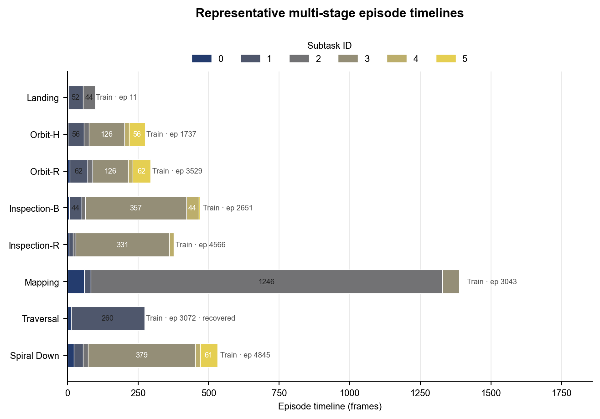

# HUGE-Bench 轻量本地复现报告（数据与标注层）

## 1. 复现目标与结论边界

复现了 HUGE-Bench 官方公开数据的任务结构、多阶段标注统计与标注完整性检查。

本报告仅覆盖数据与标注层，不把数据统计或合成 smoke test 表述为模型或论文结果。

## 2. 输入、版本与完整性校验

源数据集：yu781986168/HUGE_Dataset_v0；标注根目录：D:\university\推免\夏令营\中南大学\陶超 考核复现\HUGE-Bench\trajectory_generation\stage_annotations。

仓库 commit：d000b99794e9da85dff117db61ef874659b91ae8；manifest SHA-256：eef03c4acb5ade46c64e12c799d480b8bdf918f30ec0d93058692f27ea4c95e7。

完整性校验：PASS，共 147,263 项（PASS 147,263，FAIL 0）。

## 3. 数据规模总览

共 6,168 个 episode、27,539 个阶段片段、2,059,490 帧，任务数 8，场景数 7。

统一按 5 FPS 换算，总时长为 114.4161 小时；此换算不代表推理耗时。

## 4. 八张图的逐图解读

以下八张图均由同一摘要中的真实统计量解释，不外推到模型性能。

图 1：三种 split 的 episode 数为 train=5,175、test_seen=576、test_unseen=417，分布不均衡；这里只描述公开数据构成。

图 2：任务样本量最大的是 基础导航（2,074 条），最小的已观测任务是 农田导航（133 条）。

图 3：共 7 个场景；各任务覆盖场景数不同，体现 task-scene 异质性。

图 4：episode 长度中位数为 268.00 帧，按 5 FPS 折合 53.60 秒。

图 5：逐条 episode 观测到的阶段数类别为 1、2、3、4、5、6；该图呈现多阶段标注结构。

图 6：阶段时长 p99 为 874.24 帧，图中以此作为显示上限，避免极端长尾压缩主体分布。

图 7：recovered_from_released_actions 包含 524 个 episode、887 个阶段。recovered obstacle-action boundaries are not original human annotations; recovered_from_released_actions 不等同于原始人工阶段标注。

图 8：按固定规则为八类任务选择代表时间线（实际列出 8 条）：基础导航:train/11；高低位导航:train/1737；单目标环绕:train/3529；建筑导航:train/2651；道路跟随:train/4566；农田导航:train/3043；避障:train/3072；多目标环绕:train/4845。obstacle 的 recovered provenance 必须按发布动作恢复边界解释。

## 5. 多阶段标注与 provenance 说明

original_raw：5,644 个 episode、26,652 个阶段；recovered_from_released_actions：524 个 episode、887 个阶段。

recovered obstacle-action boundaries are not original human annotations; recovered_from_released_actions 不等同于原始人工阶段标注。

## 6. 官方 metric.py 合成 smoke test

Synthetic metric implementation smoke test — not a paper result.

状态：PASS；avg_tcr=1.0，ndtw=1.0，nsp=1.0，success=1.0，path_length=2.0。

限制：synthetic identical trajectories only; no predicted model trajectory, collision mesh, 3DGS simulator, or closed-loop evaluation; the result cannot reproduce or support the paper's model-performance table; softdtw_gamma=0.1 is used because the current official implementation with gamma 0 exhibits division-by-zero / non-finite behavior in the local probe. 该检查只验证实现可执行性，不是论文指标复现。

## 7. 本地资源使用

峰值 Python 内存：99,372,783 bytes；elapsed：7.629 秒。

以上为调用方提供的实测资源值。

不据此声称使用或未使用 GPU。

## 8. 可复现文件清单

以下相对路径链接到五张 CSV 表和机器可读 summary.json。

- [dataset_overview.csv](tables/dataset_overview.csv)
- [task_statistics.csv](tables/task_statistics.csv)
- [task_scene_matrix.csv](tables/task_scene_matrix.csv)
- [stage_statistics.csv](tables/stage_statistics.csv)
- [validation_report.csv](tables/validation_report.csv)
- [summary.json](summary.json)

## 9. 不能声称的结果

未复现 PI0/PI0.5 模型性能。

未复现论文 TCR、nDTW、NSP、CR 或 CSPL 主实验数值。

未完成 3DGS 渲染、闭环飞行或碰撞评估。

recovered_from_released_actions 不等同于原始人工阶段标注。

## 10. 下一步：AutoDL 阶段 A

下一阶段可在独立、可度量的运行中接入模型推理与资源采样；在获得新证据前，本报告的结论边界保持不变。
